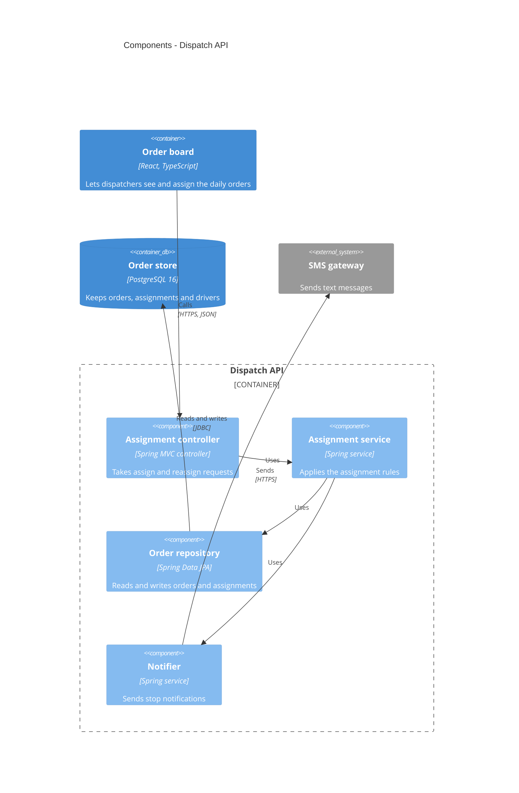

# Level 3 — Components — content and shape

Answer one question, for one container: **what is it made of?** A component is a grouping of
related functionality behind an interface inside the container — a controller, a service, a
repository, a facade, an adapter, a module. Not a class, a function or a file; that is Level 4
and is not drawn.

## How to ask

- **Pick the container first.** Ask which one is worth opening; the default is the one with the
  most logic or the most change. One is normal, two is the maximum, each with its own caption,
  block and table. The rest stay closed and the done line says so.
- Open with the hypothesis from the container's top-level packages or modules.
- "Where does a request enter, and where does it leave?" — entry points and outbound adapters
  first, the middle after.
- "Which of these could you swap without touching the others?" — a yes marks a component
  boundary; a no merges two.
- A component in no relationship: does it exist? Ask, then drop or connect it.
- About ten components per block at most. More: the container is probably two containers, or
  the grouping is too fine.
- Technology on a component that differs from its container's ("Spring Bean", "Celery task",
  "SQL view") is a decision candidate for the topic skill.

## Shape

Per container opened:

1. **One caption sentence** naming the container.
2. **One `C4Component` block**: the container as a `Container_Boundary` with its Level 2 alias
   and label, components inside; outside the boundary only the Level 2 containers and external
   systems it talks to, same aliases; `Rel` inside and across.
3. **One table**:

| Component | Responsibility | Depends on | Decided in |
|---|---|---|---|
| Assignment controller | Takes assign and reassign requests from the order board | Assignment service | — |
| Assignment service | Applies the assignment rules, keeps every order with a driver | Order repository, Notifier | [ADR-0003](adr/0003-keep-assignment-rules-in-one-service.md) |
| Order repository | Reads and writes orders and assignments | Order store | — |
| Notifier | Sends stop notifications when an assignment changes | SMS gateway | not recorded |

`Decided in` follows the Level 2 rule: a link, `—`, or `not recorded`.

## Example

Inside the Dispatch API:

## Syntax rules (no renderer here)

- `C4Component` first, optional `title` second. Outside elements, then the boundary with its
  components, then relationships, then the layout line.
- `Component(alias, "Label", "Technology", "Description")`, `ComponentDb`, `ComponentQueue`.
- The boundary is `Container_Boundary(<Level 2 alias>, "<Level 2 label>") {` … `}`; outside it
  only `Container`, `ContainerDb`, `ContainerQueue` and `System_Ext` lines copied from Level 2.
- `Rel(from, to, "Verb phrase")` inside the container; add `"Technology"` on lines that cross
  the boundary.
- The full rule list is in the topic skill; unsure, `WebFetch` https://mermaid.js.org/syntax/c4.html.

Not here: another container's inside (its own block, or Level 2); classes, functions, files
(Level 4, not drawn); the order of calls in a scenario (6); how a component is tested or built.
