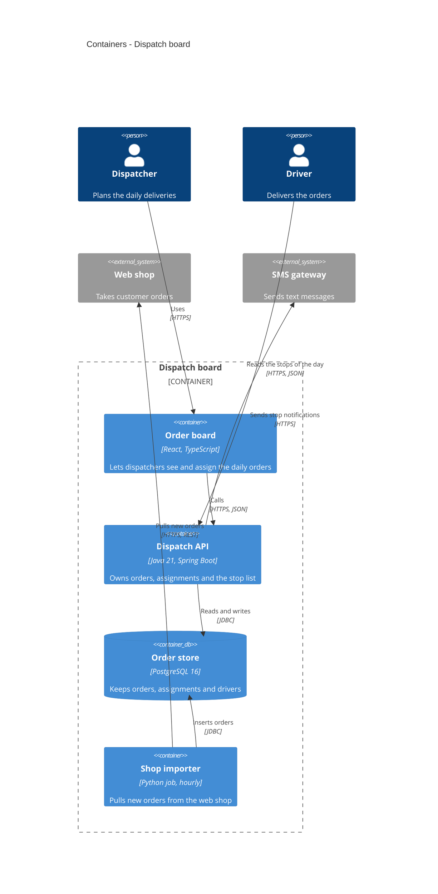

# Level 2 — Containers — content and shape

Answer one question: **what runs, separately, inside the system?** A container is a unit that
runs or is deployed on its own: a web application, a single-page app, a mobile app, an API
service, a worker, a scheduled job, a database, a blob store, a message broker, a serverless
function. Not necessarily a Docker container. Every container has a technology, and every
technology the team chose has a record.

## How to ask

- Open with the hypothesis from the manifests: "I see four things that run: … Which are real,
  which are missing?"
- "What else runs?" — jobs, workers and brokers hide behind the obvious apps.
- "Which of these stores data?" — every store is its own container.
- "What would you deploy separately?" — the merge test: two things always deployed together with
  no network between them are one container.
- For every technology cell: **chosen or imposed?** The topic skill says what happens next; the
  level's decisions are recorded before the block is drawn.
- Four to ten containers is typical. More: ask whether some are one container, or belong to
  Level 3 of another.

## Shape

1. **One caption sentence.**
2. **One `C4Container` block**: the persons and external systems from Level 1 with the **same
   aliases and labels**; one `Container_Boundary` with the system's alias and label holding
   every container; `Rel` lines with a technology on each.
3. **One table**:

| Container | Technology | Responsibility | Decided in |
|---|---|---|---|
| Order board | React, TypeScript | Lets dispatchers see and assign the daily orders | [ADR-0002](adr/0002-use-react-for-the-order-board.md) |
| Dispatch API | Java 21, Spring Boot | Owns orders, assignments and the stop list | — |
| Order store | PostgreSQL 16 | Keeps orders, assignments and drivers | [ADR-0001](adr/0001-use-postgresql-for-the-order-store.md) |
| Shop importer | Python job, hourly | Pulls new orders from the web shop | not recorded |

`Decided in` is the ADR link the `adr` skill handed back, `—` when the technology was imposed
(see 2 Constraints), or `not recorded` when the user declined. Never a title with no file
behind it.

## Example

What runs inside the dispatch board:

## Syntax rules (no renderer here)

- `C4Container` first, optional `title` second. Level 1 elements, then the boundary, then
  relationships, then the layout line.
- `Container(alias, "Label", "Technology", "Description")`, `ContainerDb`, `ContainerQueue`;
  `_Ext` variants only for a container someone else runs.
- `Container_Boundary(alias, "Label") {` on one line, `}` alone on its line.
- `Rel(from, to, "Verb phrase", "Technology")` — four arguments at this level.
- `UpdateLayoutConfig($c4ShapeInRow="3", $c4BoundaryInRow="1")` last when the block has more than
  about six shapes.
- The full rule list is in the topic skill; unsure, `WebFetch` https://mermaid.js.org/syntax/c4.html.

Not here: the modules inside a service (Level 3); machines, clusters, regions, environments (7);
the sequence of calls in a scenario (6); why a technology was chosen (its ADR).
