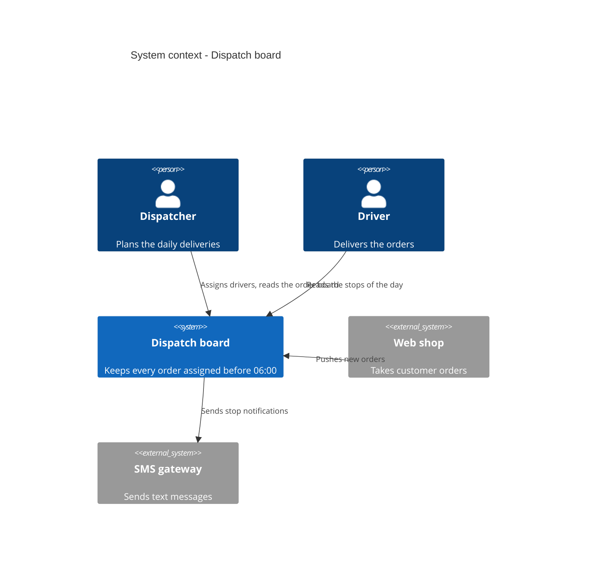

# Level 1 — System context — content and shape

Answer one question: **what is this system, and who and what does it talk to?** One box for
the system in scope, one per role that uses it, one per software system it exchanges data
with, and a labelled line for every exchange. A reader who does not code must follow it.

## How to ask

- Who uses it? Roles, not "users" and not names: "the dispatcher", "the driver". Reuse the roles
  of 1.3 Stakeholders verbatim where that section exists.
- Which software does it send data to, or get data from? One box per system, not per API.
- For each line: what crosses it, in which direction, and — only if the user volunteers it —
  how. The verb is the content: "assigns drivers", "pushes order updates to".
- Who owns each neighbour? Your organisation or a third party decides whether an
  `Enterprise_Boundary` is worth drawing.
- Tests: an element in no relationship is noise — ask, then drop it. Something that lives
  *inside* the system is a container: "that is Level 2, noted" and move on. A choice of
  neighbour ("we talk to the shop, not the ERP") is a decision candidate for the topic skill.

## Shape

1. **One caption sentence** saying what the picture shows.
2. **One `C4Context` block**, no more than about twelve elements: exactly one `System` in
   scope; `Person` per role, `Person_Ext` for roles outside the organisation; `System_Ext` per
   neighbour, `SystemDb_Ext` or `SystemQueue_Ext` when the neighbour is a store or a broker
   someone else owns.
3. **One table**:

| Element | Type | Responsibility | Exchange with the system |
|---|---|---|---|
| Dispatcher | Person | Plans the daily deliveries | Assigns drivers, reads the order board |
| Driver | Person | Delivers the orders | Reads the stops of the day |
| Dispatch board | Software system (in scope) | Keeps every order assigned before 06:00 | — |
| Web shop | Software system (external) | Takes customer orders | Pushes new orders to it |
| SMS gateway | Software system (external) | Sends text messages | Receives stop notifications from it |

Type is one of: Person, Person (external), Software system (in scope), Software system
(external). No `Decided in` column at this level.

## Example

Who the dispatch board serves and what it talks to:

## Syntax rules (no renderer here)

- `C4Context` first, optional `title` second. Elements before relationships.
- `Person(alias, "Label", "Description")`, `System(alias, "Label", "Description")`,
  `System_Ext`, `SystemDb_Ext`, `SystemQueue_Ext` the same. `Enterprise_Boundary(alias, "Label") {`
  … `}` only when own and third-party systems need separating.
- `Rel(from, to, "Verb phrase")`; add a fourth argument `"Technology"` only when the user named
  one. `BiRel` when data flows both ways with the same meaning.
- Aliases are letters, digits and underscore, and are reused unchanged at Levels 2 and 3.
- The full rule list is in the topic skill; unsure, `WebFetch` https://mermaid.js.org/syntax/c4.html.

Not here: what runs inside the system (Level 2); data formats and channel details (3.2
Technical context); where it is hosted (7); the order of calls in a scenario (6).
