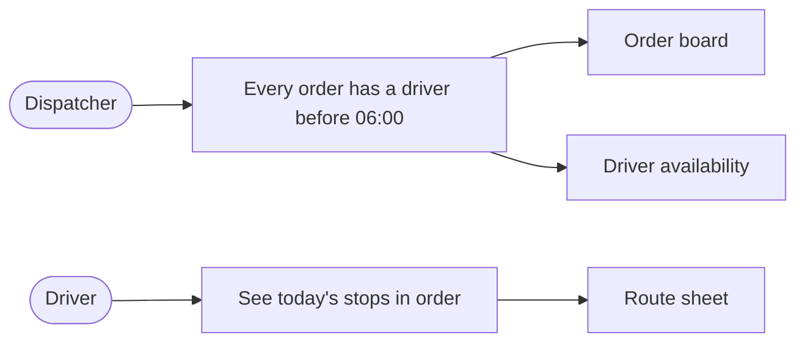
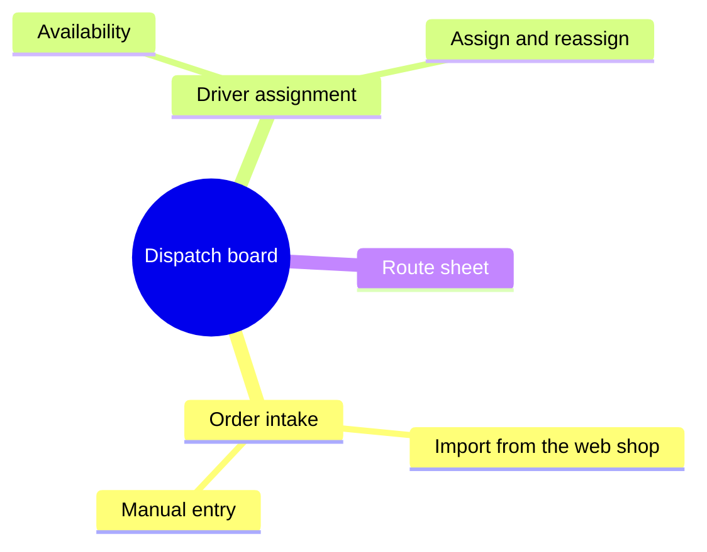

# 1.1 Requirements overview — content and shape

Answer four questions a new colleague asks in the first ten minutes: **what** the system does,
**for whom**, **which few features** make it worth having, **what drove someone to build it**.
Ask in that order; the topic skill says how. An existing requirements document or backlog is
linked by title (after `WebFetch`), not copied.

## Shape

1. **One paragraph**, four to six sentences, plain language.
2. **Must-have features**: three to seven bullets, name plus one clause on what it lets someone do.
3. **Diagrams**: as many as make the requirements visible, each under one plain sentence saying
   what it shows. A diagram carries nothing the paragraph and list do not already say; a node
   you cannot trace to a sentence above is a missing interview question. Two diagrams showing
   the same relation: keep one.

Two diagram types, two questions:

| Question | Diagram |
|---|---|
| Who wants what, and which feature gives it to them? | `flowchart LR`: actor → goal → feature |
| What are the features, and what sits under each? | `mindmap`: system at the root, features one level down, two levels at most |

Not here: neighbouring systems, channels or data flows (that is 3.1 Business context); sequence,
class, ER or C4 diagrams (sections 5–8). Nodes in 1.1 are people, goals and features only.

## Examples

Who wants what:

Feature tree:

## Syntax rules (no renderer here)

- Each diagram is a `mermaid` block under fifteen lines; longer has dropped below section 1 altitude.
- Flowchart: ids letters and digits, never `end`; quote every label `id["text"]`; one edge per
  line; actors as `id(["Name"])`; no `click`, `style` or HTML.
- Mindmap: one root `root((Name))`; spaces not tabs, consistent indent; no brackets, parentheses
  or colons in node text.
- Unsure of a construct: `WebFetch` its page under https://mermaid.js.org/syntax/. That is for
  you, not for Resources.
- The user sees source, not a picture. Keep the caption above each block in the draft so they
  approve what it shows.
